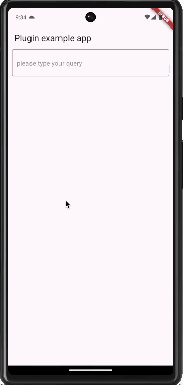

# search_field

a dependency search field plugins / library for flutter

## Getting Started

1) add below line in your `pubspec.yaml`


```cmd
text_search_field: ^0.0.1
```

2) call below given command


```cmd
flutter pub get

```


## Example

1) simple Example

```dart
import 'package:search_field/search_field.dart';
/// global variable
final _firstController = SearchFieldController();

TextSearchField(
  controller: _firstController,
  filterItems: [
    TextSearchFieldDataModel(key: "hey", value: "hello"),
    TextSearchFieldDataModel(key: "hey_1", value: "bro"),
    TextSearchFieldDataModel(key: "hey_2", value: "how are you"),
  ],
  onSelected: (primarySelected, index, item) async {
    print("primary item selected: $primarySelected");
    print("selected item index: $index");
    print("item key: ${item.key}, value: ${item.value}");
    },
)

```
## demo



## contributor

[@Aditya panther](https://github.com/Adityapanther/)


